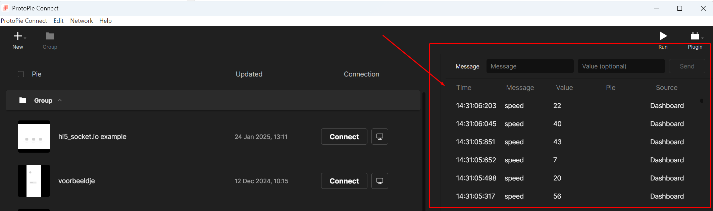
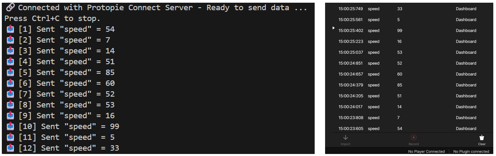

# Hybrid Prototyping Templates
New tools increasingly allow us to rapidly design, prototype and test smart products in which different objects, screens etc interact in smart ways. This advances opportunities in rapid interactive prototyping ranging from wizard of Oz prototyping to independently running prototypes. This rapo covers some of the tools, scripts and workarounds I have been exploring.

## Protopie ~ external environmments
While [Protopie](https://www.protopie.io/) is a fantastic environment for rapid interactiond design (e.g. allowing more interactive flexibility compared to [Figma](https://www.figma.com/)), the free tier opportunities to coneect 'pies' to the outside world are limited to 3 min timeframes. The enterprise version is not very student-friendly, so I have been develping a couple of workarounds.

### node.js & selenium
Tapping directly into the 'pie2pie' socket.io connections is shielded, but when you open protopie connect, a web version of the interface is running on http://localhost:9981/. This means we can access the data directly over the DOM using [Selemium](https://www.selenium.dev/). This approach opens a web browser and reads the data monitoring table on the right.Using the input field on the top, you can also enter information.    

Once your connected this way, you can build any connection you want from this server.

    

   

**Configuration**
To set this up you'll need to install and set-up the following:
* [Install node.js](https://nodejs.org/en)
* install packages `npm install selenium-webdriver`

**Samples and demo templates**
run with `node <filename.js>`
* [receive.js](/selenium/receive.js): Read latest entry in the data overview and print as JSON (capture pie 'send' messages)
* [send.js](/selenium/send.js): Generate a random number and publish in protopie connect (can be 'reveived' by pies)

    

   

### Custom API
The easiest way to work with **wireless** Arduino devices is to set-up your own API (node.js). This API allows you to send and receive data using http GET and POST commands. Connect your Arduino to the same wifi network as the Protopie Connect computer and run the node.js API server using `node <filename.js>`   
_Note: You will still be constrained to the 3 minute limit of the free tier._

* [example.js](/API/example.js): Reading and sending API messages

